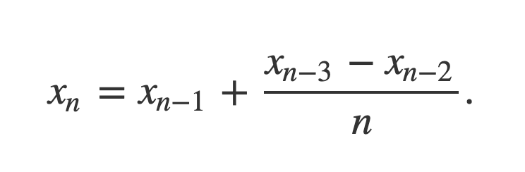
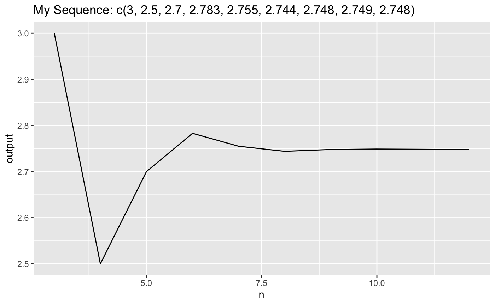

<!-- README.md is generated from README.Rmd. Please edit that file -->

```{r, include = FALSE}
knitr::opts_chunk$set(
  collapse = TRUE,
  comment = "#>",
  fig.path = "man/figures/README-",
  out.width = "100%"
)
```

# hw04ptwyunting

<!-- badges: start -->
<!-- badges: end -->

The goal of hw04ptwyunting is to accomplish a math formula in sequence with a proper graph.

## Author
My name is Yunting Chiu, and I am a Data Science student at American University.\
For more details about me please visit my [GitHub](https://github.com/twyunting) and  [LinkedIn](https://www.linkedin.com/in/yuntingchiu/).

## Installation

You can install the released version of `hw04ptwyunting` by asking me.\
My GitHub ID is: [twyunting](https://github.com/twyunting) or mailing me: yc6705a@american.edu

``` r
install.packages("hw04ptwyunting")
```

## Functions
**hw04ptwyunting** package includes two functions.\
1. `myseq_n()`\
2. `numSeqPlot()`\

## Examples
#### myseq_n()

- The recursive sequence defined by:

- `myseq_n()` needs two inputs, the first is a vector **x** containing the first three numbers of this sequence. The second one is a positive (>0) integer **n** which represents the final `n`th element in the sequence to calculate.\

- This is a basic example which shows you how to use `myseq_n()` function:\
```{r example}
library(hw04ptwyunting)
myseq_n(x = c(2, 3, 3), n = 3)
myseq_n(x = c(2, 4, 3), n = 4)
myseq_n(x = c(2, 4, 3), n = 5)
myseq_n(x = c(2, 4, 3), n = 6)
myseq_n(x = c(2, 4, 3), n = 7)
```

#### numSeqPlot()
This function `numSeqPlot()` shows a line graph that plots the relation between first three columns and fourth column.\
- The prerequisite is this data frame must have four columns.\
- The first three columns are the values of the three numeric to be input, and the fourth column is the positive integer **n** for the sequence to be generated.\
- `numSeqPlot()` should return a line plot of the output values for the different values of **n**. This graph shows the output of x-axis is called **n** with input of fourth column, the output of y-axis is called **output** with the first three terms in the sequence.\
- This is a basic example which shows you how to use `numSeqPlot()` function:\
```{r}
# testing the function
my_data <- tibble::tribble(
  ~x, ~y, ~z, ~n,
  2,4,3,3,
  2,4,3,4,
  2,4,3,5,
  2,4,3,6,
  2,4,3,7,
  2,4,3,8,
  2,4,3,9,
  2,4,3,10,
  2,4,3,12)

# numSeqPlot(my_data)
```


